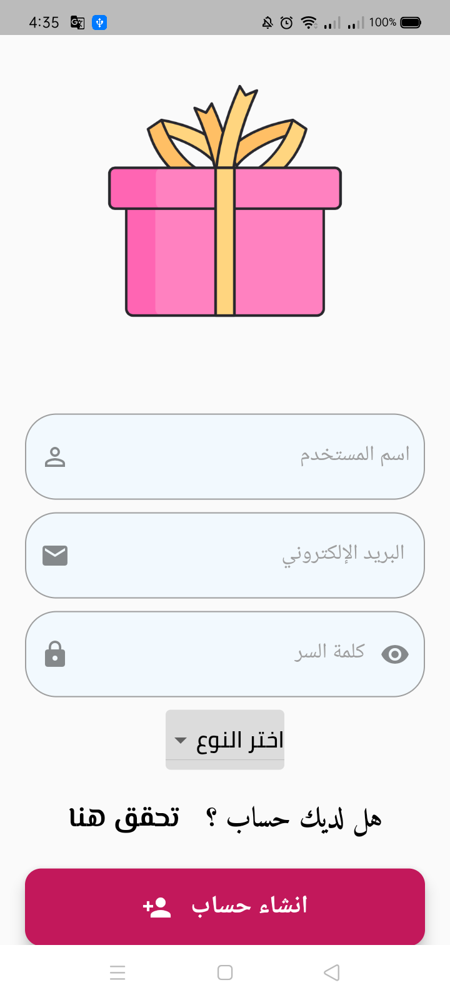

	

# Tahado تطبيق تهادوا
	

You can add products to display for sale when you register as a seller – Tahado
Those who want to buy products can register as a buyer and browse the appropriate gift. The application provides most of the categories of gifts

# 

# Seller Pages

# Customer Pages

# Package

## cached_network_image:   A flutter library to show images from the internet and keep them in the cache directory.

## cloud_firestore:

## firebase_auth:

## firebase_core: 

## firebase_storage:

## flutter_localizations : How to track the device’s locale (the user’s preferred language).

## google_fonts : The google_fonts package for Flutter allows you to easily use any of the thousands of fonts available from fonts.google.com in your Flutter app.

## flutter_riverpod: A state-management library 

## intl : Provides internationalization and localization facilities, including message translation, plurals and genders, date/number formatting and parsing, and bidirectional text.

## image_picker: A Flutter plugin for iOS and Android for picking images from the image library, and taking new pictures with the camera.

## share_plus : A Flutter plugin to share content from your Flutter app via the platform's share dialog.

## url_launcher : A Flutter plugin for launching a URL. Supports iOS, Android, web, Windows, macOS, and Linux.

## uuid : RFC4122 (v1, v4, v5) UUID Generator and Parser for all Dart platforms (Web, VM, Flutter)

## change_app_package_name : Change App Package Name with single command. It makes the process very easy and fast.

## flutter_native_splash : Customize Flutter's default white native splash screen with background color and splash image. Supports dark mode, full screen, and more.
